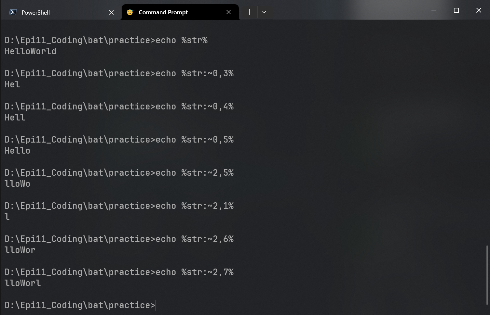

# ✅ 示例：模糊查找并杀掉进程名中包含 chrome 的程序
~~~
for /f "tokens=2 delims= " %%i in ('tasklist ^| findstr /i chrome') do taskkill /pid %%i /f 
~~~
- `/f`：逐行读取文件内容
- `tokens=2 delims= `：取第二行，按空格分割
- `%%i`和`%i`为在bat文件内运行和cmd终端运行
- `('tasklist ^| findstr /i chrome')`：这里使用`''`和`^|`转义符是为了防止`for`命令将前后分为两个语句
- `taskkill /pid %%i /f`：将指定的进程名程序杀死

## 🧩 扩展用法（高级）：
### ▶ 只杀掉特定用户下的进程：
~~~
tasklist /v | findstr /i "chrome myusername"
~~~
### ▶ 匹配多个关键词：
~~~
tasklist | findstr /i "chrome firefox"
~~~
### ▶ 过滤多个字段（通过正则）：
~~~
tasklist | findstr /r /i "notepad.*Console"
~~~
# ✅ for 循环常用语法和选项
## 🧩 常用结构一：遍历文件列表
~~~
for %%f in (*.txt) do echo %%f
~~~
## 🧩 常用结构二：读取文件内容（逐行处理）
~~~
for /f "tokens=1,2 delims= " %%a in (data.csv) do echo 第一列=%%a 第二列=%%b
~~~
## 🧩 常用结构三：命令输出处理
~~~
for /f "usebackq tokens=*" %%i in ('tasklist ^| findstr notepad') do echo %%i
~~~
- `usebackq`：让命令用反引号包围
- `tokens=*`：整行提取(防止空格截断)

## 🔧 for 参数说明：
|**参数**|**作用**|
|:---:|:---:|
|`/f`|从文本文件或命令输出中逐行读取|
|`/r`|递归遍历目录|
|`/d`|	仅匹配目录名|
|`tokens=n`|指定取第几列(n可以是多个)|
|`delims=x`|指定分隔符(默认为空格和制表符)|
|`usebackq`|使用反引号执行命令/支持文件路径含空格|
# ✅ if 语句常用结构
## 🧩 结构一：字符串比较
~~~
if "%var%"=="hello" echo 是hello
~~~
## 🧩 结构二：数字比较
~~~
if %num% GEQ 100 echo 大于等于100
~~~
|**比较符**|**含义**|
|:---:|:---:|
|`==`|等于(字符串)|
|`NEQ`|不等于|
|`LSS`|小于|
|`LEQ`|小于等于|
|`GTR`|大于|
|`GEQ`|大于等于|
> ⚠ 注意：数字比较时变量不能加引号。
## 🧩 结构三：文件/目录判断
~~~
if exist myfile.txt echo 文件存在
if not exist myfolder\NUL echo 文件夹不存在
~~~
🧩 结构四：带括号的多语句判断（推荐）
~~~
if "%var%"=="yes" (
    echo 用户确认
    echo 正在继续
) else (
    echo 用户取消
)
~~~
- [x] 练习一

- [x] 练习二

- [x] 练习三
# 📝 练习1：遍历所有 .log 文件，并显示文件名和行数
~~~
for %%f in (*.log) do (]
    echo 文件：%%f
    find /c /v "" "%%f"
)
~~~
## ✅ 各部分含义
|**部分**|**含义**|
|:---:|:---:|
|`find`|Windows的文本查找命令|
|`/c`|只显示匹配行的数量|
|`/v ""`|匹配所有"**不包含空字符串**"的行->相当于"所有行"|
|`%%f`|要处理的文件名(在`for`循环中)|
# 📝 练习2：读取CSV文件并判断分数是否及格

# 📝 练习3：用 tasklist 和 if 判断某进程是否存在
~~~
tasklist | findstr /i notepad >nul
if errorlevel 1 (
    echo Notepad 没有运行
) else (
    echo Notepad 正在运行
)
~~~
# ✨字符串截取语法
## ✅ 通用语法：
~~~
%变量名:~起始位置,长度%
~~~
- *起始位置*：从0开始
- *长度*：截取的字符数(可以省略，表示到结尾)
## ✅ 举例说明：
### 📆 示例1：处理 %date%
假设 *%date% = 2025/04/29*

| 表达式               | 结果     | 说明                         |
|----------------------|----------|------------------------------|
| `%date:~0,4%`        | `2025`   | 年                           |
| `%date:~5,2%`        | `04`     | 月                           |
| `%date:~8,2%`        | `29`     | 日                           |
